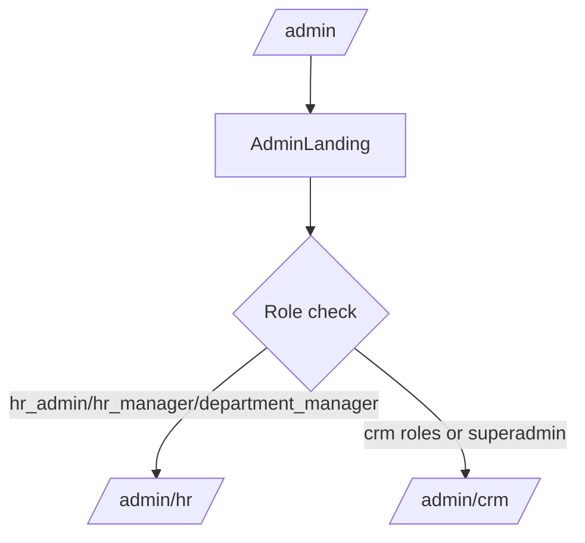
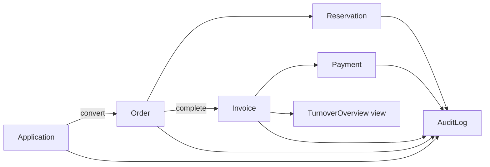
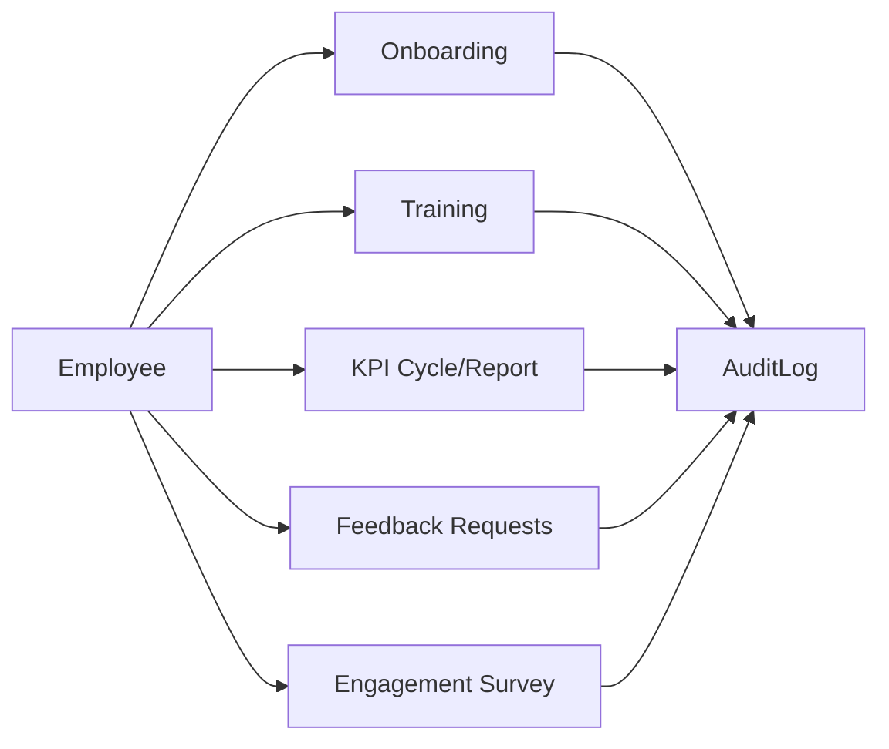

# Developer Guide

This guide covers local setup, project structure, runtime behavior, and how to add new modules.

## Quick Start (Local Setup)
1) Install dependencies:
   - `composer install`
   - `npm install`
2) Configure `.env` (database credentials; default DB name is `crm`).
3) Run migrations and seed roles:
   - `php artisan migrate`
   - `php artisan db:seed`
4) Create a Filament admin user:
   - `php artisan make:filament-user`
5) Run the app:
   - `php artisan serve`
   - `npm run dev`
6) Visit the admin panel at `/admin` (role-based redirect to `/admin/hr` or `/admin/crm`).

Tip: `composer run dev` runs server, queue, logs, and Vite together.

## Project Structure Summary
- `app/Models/Crm` and `app/Models/Hr`: domain models and relationships.
- `app/Enums` and `app/Enums/Hr`: status enums and transition rules.
- `app/Models/Concerns`: shared model behaviors (status transitions, created_by).
- `app/Observers/Crm` and `app/Observers/Hr`: audit logging and domain side effects.
- `app/Policies/Crm` and `app/Policies/Hr`: authorization policies per entity.
- `app/Filament/Resources/Crm` and `app/Filament/Resources/Hr`: CRUD UI for each entity.
- `app/Filament/Widgets/Crm` and `app/Filament/Widgets/Hr`: dashboard widgets and charts.
- `app/Filament/Exports/Crm`: export definitions for CSV/Excel.
- `app/Filament/Pages/AdminLanding.php`: role-based redirect at `/admin`.
- `app/Providers/Filament/AdminPanelProvider.php`: Filament panel configuration.
- `database/migrations`: schema and turnover view.
- `database/seeders`: roles and permissions seeding.
- `docs`: business and technical documentation.

See `docs/CRM_Technical_Reference.md` for runtime behavior and `docs/HR_Module.md` for HR details.

## Full Project Inventory

### Top-Level Layout
```
app
artisan
bootstrap
composer.json
composer.lock
config
database
docs
node_modules
package.json
package-lock.json
phpunit.xml
public
README.md
resources
routes
storage
tests
vendor
vite.config.js
```

### app/
```
app/Support/Permissions.php
app/Filament/Resources/Hr/TrainingParticipantResource.php
app/Filament/Resources/Hr/EmployeeDocumentResource.php
app/Filament/Resources/Hr/ContractTypeResource.php
app/Filament/Resources/Hr/EmployeeResource.php
app/Filament/Resources/Hr/FeedbackRequestResource.php
app/Filament/Pages/Hr/HrDashboard.php
app/Filament/Resources/Hr/ContractTypeResource/Pages/EditContractType.php
app/Filament/Resources/Hr/ContractTypeResource/Pages/ListContractTypes.php
app/Filament/Resources/Hr/ContractTypeResource/Pages/CreateContractType.php
app/Filament/Resources/Hr/ContractTypeResource/Pages/ViewContractType.php
app/Filament/Resources/Hr/CandidateResource.php
app/Filament/Pages/Crm/CrmDashboard.php
app/Filament/Pages/AdminLanding.php
app/Models/Hr/Onboarding/EmployeeOnboarding.php
app/Models/Hr/Onboarding/OnboardingTemplate.php
app/Models/Hr/Onboarding/OnboardingTemplateTask.php
app/Models/Hr/Onboarding/EmployeeOnboardingTask.php
app/Filament/Resources/Crm/OrderResource.php
app/Services/AuditLogger.php
app/Models/Hr/Survey/SurveySubmission.php
app/Filament/Resources/Hr/BranchResource/Pages/EditBranch.php
app/Models/Hr/Survey/EngagementSurvey.php
app/Filament/Resources/Hr/BranchResource/Pages/ListBranches.php
app/Models/Hr/Survey/SurveyAnswer.php
app/Filament/Resources/Hr/BranchResource/Pages/CreateBranch.php
app/Models/Hr/Survey/SurveyQuestion.php
app/Filament/Resources/Hr/BranchResource/Pages/ViewBranch.php
app/Models/Hr/ContractType.php
app/Models/Hr/Employee.php
app/Filament/Resources/Hr/EmployeeDocumentResource/Pages/ListEmployeeDocuments.php
app/Filament/Resources/Hr/EmployeeDocumentResource/Pages/EditEmployeeDocument.php
app/Filament/Resources/Hr/EmployeeDocumentResource/Pages/ViewEmployeeDocument.php
app/Filament/Resources/Hr/EmployeeDocumentResource/Pages/CreateEmployeeDocument.php
app/Filament/Resources/Hr/EmployeeOnboardingResource.php
app/Filament/Resources/Hr/KpiCycleResource.php
app/Models/Hr/Recruitment/Candidate.php
app/Models/Hr/Position.php
app/Models/Hr/Branch.php
app/Filament/Resources/Crm/ApplicationResource.php
app/Filament/Resources/Crm/CustomerResource.php
app/Filament/Resources/Crm/InvoiceResource.php
app/Services/Hr/KpiScoreCalculator.php
app/Services/Hr/HrReportService.php
app/Models/Hr/Training/TrainingSession.php
app/Models/Hr/Training/TrainingParticipant.php
app/Filament/Resources/Hr/KpiCycleResource/Pages/EditKpiCycle.php
app/Filament/Resources/Hr/KpiCycleResource/Pages/CreateKpiCycle.php
app/Filament/Resources/Hr/KpiCycleResource/Pages/ViewKpiCycle.php
app/Models/User.php
app/Filament/Resources/Hr/KpiCycleResource/Pages/ListKpiCycles.php
app/Filament/Resources/Hr/KpiReportResource.php
app/Filament/Resources/Hr/BranchResource.php
app/Filament/Resources/Hr/KpiTemplateResource.php
app/Models/Hr/Kpi/KpiCycle.php
app/Models/Hr/Kpi/KpiTemplate.php
app/Filament/Resources/Hr/EmployeeResource/Pages/CreateEmployee.php
app/Models/Hr/Kpi/KpiTemplateItem.php
app/Filament/Resources/Hr/EmployeeResource/Pages/ListEmployees.php
app/Models/Hr/Kpi/KpiReportItem.php
app/Filament/Resources/Hr/EmployeeResource/Pages/EditEmployee.php
app/Filament/Resources/Hr/EmployeeResource/Pages/ViewEmployee.php
app/Models/Hr/Kpi/KpiReport.php
app/Filament/Resources/Crm/CustomerResource/Pages/ListCustomers.php
app/Filament/Resources/Crm/CustomerResource/Pages/ViewCustomer.php
app/Filament/Resources/Crm/CustomerResource/Pages/CreateCustomer.php
app/Filament/Resources/Crm/CustomerResource/Pages/EditCustomer.php
app/Models/Hr/EmployeeDocument.php
app/Jobs/Hr/SendContractExpirationReminders.php
app/Jobs/Hr/SendOnboardingDelayAlerts.php
app/Filament/Resources/Crm/TurnoverOverviewResource/Pages/CreateTurnoverOverview.php
app/Filament/Resources/Crm/TurnoverOverviewResource/Pages/EditTurnoverOverview.php
app/Filament/Resources/Crm/TurnoverOverviewResource/Pages/ListTurnoverOverviews.php
app/Filament/Resources/Hr/TrainingSessionResource/Pages/EditTrainingSession.php
app/Filament/Resources/Hr/TrainingSessionResource/Pages/ViewTrainingSession.php
app/Filament/Resources/Hr/TrainingSessionResource/Pages/ListTrainingSessions.php
app/Filament/Resources/Hr/TrainingSessionResource/Pages/CreateTrainingSession.php
app/Filament/Resources/Hr/FeedbackCycleResource.php
app/Models/Hr/Feedback/FeedbackAnswer.php
app/Models/Hr/Feedback/FeedbackQuestion.php
app/Models/Hr/Feedback/FeedbackCycle.php
app/Models/Hr/Feedback/FeedbackRequest.php
app/Filament/Resources/Hr/EmployeeResource/RelationManagers/EmployeeDocumentsRelationManager.php
app/Filament/Resources/Hr/EmployeeResource/RelationManagers/KpiReportsRelationManager.php
app/Models/Hr/Department.php
app/Filament/Resources/Crm/TurnoverOverviewResource.php
app/Models/Crm/Customer.php
app/Models/Crm/Order.php
app/Models/Crm/Reservation.php
app/Models/Crm/Payment.php
app/Models/Crm/TurnoverOverview.php
app/Models/Crm/Invoice.php
app/Filament/Resources/Crm/CustomerResource/RelationManagers/OrdersRelationManager.php
app/Filament/Resources/Hr/TrainingSessionResource.php
app/Models/Crm/Vehicle.php
app/Filament/Resources/Hr/DepartmentResource.php
app/Models/Crm/Application.php
app/Models/AuditLog.php
app/Filament/Resources/Hr/SurveySubmissionResource/Pages/ViewSurveySubmission.php
app/Filament/Resources/Hr/SurveySubmissionResource/Pages/EditSurveySubmission.php
app/Filament/Resources/Hr/SurveySubmissionResource/Pages/ListSurveySubmissions.php
app/Filament/Resources/Hr/SurveySubmissionResource/Pages/CreateSurveySubmission.php
app/Filament/Resources/Crm/ApplicationResource/Pages/CreateApplication.php
app/Filament/Resources/Crm/ApplicationResource/Pages/ViewApplication.php
app/Filament/Resources/Crm/ApplicationResource/Pages/ListApplications.php
app/Filament/Resources/Crm/ApplicationResource/Pages/EditApplication.php
app/Models/Concerns/EnforcesStatusTransitions.php
app/Models/Concerns/AssignsCreator.php
app/Filament/Resources/Crm/OrderResource/Pages/CreateOrder.php
app/Filament/Resources/Crm/OrderResource/Pages/EditOrder.php
app/Filament/Resources/Crm/OrderResource/Pages/ViewOrder.php
app/Filament/Resources/Crm/OrderResource/Pages/ListOrders.php
app/Filament/Resources/Crm/InvoiceResource/Pages/ListInvoices.php
app/Filament/Resources/Crm/InvoiceResource/Pages/CreateInvoice.php
app/Filament/Resources/Crm/InvoiceResource/Pages/EditInvoice.php
app/Filament/Resources/Crm/InvoiceResource/Pages/ViewInvoice.php
app/Filament/Resources/Hr/EmployeeOnboardingResource/Pages/ListEmployeeOnboardings.php
app/Filament/Resources/Hr/EmployeeOnboardingResource/Pages/EditEmployeeOnboarding.php
app/Filament/Resources/Hr/EmployeeOnboardingResource/Pages/CreateEmployeeOnboarding.php
app/Filament/Resources/Hr/EmployeeOnboardingResource/Pages/ViewEmployeeOnboarding.php
app/Filament/Resources/Crm/PaymentResource.php
app/Filament/Resources/Crm/PaymentResource/Pages/ViewPayment.php
app/Filament/Resources/Crm/PaymentResource/Pages/EditPayment.php
app/Filament/Resources/Crm/PaymentResource/Pages/CreatePayment.php
app/Filament/Resources/Crm/ApplicationResource/Pages/Concerns/ConvertsApplicationToOrder.php
app/Filament/Resources/Crm/PaymentResource/Pages/ListPayments.php
app/Filament/Resources/Crm/VehicleResource.php
app/Filament/Resources/Crm/ReservationResource.php
app/Filament/Resources/Hr/SurveySubmissionResource/RelationManagers/SurveyAnswersRelationManager.php
app/Filament/Resources/Crm/ReservationResource/Pages/ViewReservation.php
app/Filament/Resources/Crm/ReservationResource/Pages/ListReservations.php
app/Filament/Resources/Crm/ReservationResource/Pages/CreateReservation.php
app/Filament/Resources/Crm/ReservationResource/Pages/EditReservation.php
app/Filament/Resources/Hr/EngagementSurveyResource.php
app/Filament/Resources/Hr/EmployeeOnboardingResource/RelationManagers/EmployeeOnboardingTasksRelationManager.php
app/Filament/Resources/Crm/OrderResource/RelationManagers/InvoicesRelationManager.php
app/Filament/Resources/Crm/VehicleResource/Pages/ViewVehicle.php
app/Filament/Resources/Crm/VehicleResource/Pages/ListVehicles.php
app/Filament/Resources/Crm/VehicleResource/Pages/EditVehicle.php
app/Filament/Resources/Crm/VehicleResource/Pages/CreateVehicle.php
app/Filament/Resources/Hr/CandidateResource/Pages/EditCandidate.php
app/Filament/Resources/Hr/CandidateResource/Pages/CreateCandidate.php
app/Filament/Resources/Hr/CandidateResource/Pages/ViewCandidate.php
app/Filament/Resources/Hr/CandidateResource/Pages/ListCandidates.php
app/Filament/Resources/Hr/KpiTemplateResource/Pages/EditKpiTemplate.php
app/Filament/Resources/Hr/KpiTemplateResource/Pages/ViewKpiTemplate.php
app/Filament/Resources/Hr/KpiTemplateResource/Pages/CreateKpiTemplate.php
app/Filament/Resources/Hr/KpiTemplateResource/Pages/ListKpiTemplates.php
app/Filament/Resources/Hr/PositionResource/Pages/CreatePosition.php
app/Filament/Resources/Hr/PositionResource/Pages/ListPositions.php
app/Filament/Resources/Hr/PositionResource/Pages/EditPosition.php
app/Filament/Resources/Hr/PositionResource/Pages/ViewPosition.php
app/Filament/Resources/Hr/SurveySubmissionResource.php
app/Filament/Resources/Hr/OnboardingTemplateResource.php
app/Filament/Resources/Hr/OnboardingTemplateResource/RelationManagers/OnboardingTemplateTasksRelationManager.php
app/Filament/Resources/Hr/OnboardingTemplateResource/Pages/ViewOnboardingTemplate.php
app/Filament/Resources/Hr/OnboardingTemplateResource/Pages/EditOnboardingTemplate.php
app/Filament/Resources/Hr/OnboardingTemplateResource/Pages/CreateOnboardingTemplate.php
app/Filament/Resources/Hr/OnboardingTemplateResource/Pages/ListOnboardingTemplates.php
app/Policies/Hr/ContractTypePolicy.php
app/Policies/Hr/PositionPolicy.php
app/Policies/Hr/EmployeeOnboardingTaskPolicy.php
app/Policies/Hr/FeedbackAnswerPolicy.php
app/Filament/Exports/Crm/ReservationExporter.php
app/Filament/Exports/Crm/VehicleExporter.php
app/Filament/Exports/Crm/ApplicationExporter.php
app/Filament/Exports/Crm/InvoiceExporter.php
app/Filament/Exports/Crm/OrderExporter.php
app/Filament/Exports/Crm/CustomerExporter.php
app/Filament/Exports/Crm/PaymentExporter.php
app/Filament/Exports/Crm/TurnoverOverviewExporter.php
app/Filament/Resources/Hr/EngagementSurveyResource/Pages/ViewEngagementSurvey.php
app/Filament/Resources/Hr/EngagementSurveyResource/Pages/EditEngagementSurvey.php
app/Filament/Resources/Hr/EngagementSurveyResource/Pages/ListEngagementSurveys.php
app/Filament/Resources/Hr/PositionResource.php
app/Filament/Resources/Hr/EngagementSurveyResource/Pages/CreateEngagementSurvey.php
app/Policies/Hr/Concerns/ScopesHrAccess.php
app/Policies/Hr/TrainingParticipantPolicy.php
app/Policies/Hr/SurveyQuestionPolicy.php
app/Policies/Hr/SurveySubmissionPolicy.php
app/Policies/Hr/KpiReportPolicy.php
app/Policies/Hr/KpiCyclePolicy.php
app/Policies/Hr/FeedbackRequestPolicy.php
app/Filament/Resources/Hr/FeedbackCycleResource/RelationManagers/FeedbackQuestionsRelationManager.php
app/Filament/Resources/Hr/KpiTemplateResource/RelationManagers/KpiTemplateItemsRelationManager.php
app/Filament/Resources/Hr/DepartmentResource/Pages/CreateDepartment.php
app/Filament/Resources/Hr/DepartmentResource/Pages/ListDepartments.php
app/Filament/Resources/Hr/DepartmentResource/Pages/ViewDepartment.php
app/Filament/Resources/Hr/DepartmentResource/Pages/EditDepartment.php
app/Filament/Resources/Hr/FeedbackRequestResource/RelationManagers/FeedbackAnswersRelationManager.php
app/Filament/Resources/Hr/FeedbackRequestResource/Pages/EditFeedbackRequest.php
app/Filament/Resources/Hr/FeedbackRequestResource/Pages/ViewFeedbackRequest.php
app/Filament/Resources/Hr/FeedbackRequestResource/Pages/ListFeedbackRequests.php
app/Filament/Resources/Hr/FeedbackCycleResource/Pages/CreateFeedbackCycle.php
app/Policies/Hr/EngagementSurveyPolicy.php
app/Filament/Resources/Hr/FeedbackCycleResource/Pages/ViewFeedbackCycle.php
app/Policies/Hr/OnboardingTemplateTaskPolicy.php
app/Filament/Resources/Hr/FeedbackCycleResource/Pages/EditFeedbackCycle.php
app/Policies/Hr/EmployeeDocumentPolicy.php
app/Filament/Resources/Hr/FeedbackCycleResource/Pages/ListFeedbackCycles.php
app/Policies/Hr/KpiTemplateItemPolicy.php
app/Policies/Hr/TrainingSessionPolicy.php
app/Policies/Hr/EmployeeOnboardingPolicy.php
app/Policies/Hr/FeedbackCyclePolicy.php
app/Policies/Hr/BranchPolicy.php
app/Filament/Resources/Hr/EngagementSurveyResource/RelationManagers/SurveySubmissionsRelationManager.php
app/Filament/Resources/Hr/FeedbackRequestResource/Pages/CreateFeedbackRequest.php
app/Filament/Resources/Hr/EngagementSurveyResource/RelationManagers/SurveyQuestionsRelationManager.php
app/Policies/Hr/DepartmentPolicy.php
app/Policies/Hr/OnboardingTemplatePolicy.php
app/Policies/Hr/SurveyAnswerPolicy.php
app/Policies/Hr/CandidatePolicy.php
app/Policies/Hr/KpiReportItemPolicy.php
app/Policies/Hr/KpiTemplatePolicy.php
app/Policies/Hr/FeedbackQuestionPolicy.php
app/Policies/Hr/EmployeePolicy.php
app/Filament/Resources/Hr/TrainingParticipantResource/Pages/EditTrainingParticipant.php
app/Filament/Resources/Hr/TrainingParticipantResource/Pages/CreateTrainingParticipant.php
app/Policies/Crm/PaymentPolicy.php
app/Filament/Resources/Hr/TrainingParticipantResource/Pages/ViewTrainingParticipant.php
app/Filament/Resources/Hr/TrainingParticipantResource/Pages/ListTrainingParticipants.php
app/Providers/AuthServiceProvider.php
app/Policies/Crm/OrderPolicy.php
app/Policies/Crm/ReservationPolicy.php
app/Policies/Crm/InvoicePolicy.php
app/Policies/Crm/CustomerPolicy.php
app/Policies/Crm/ApplicationPolicy.php
app/Policies/Crm/VehiclePolicy.php
app/Policies/Crm/TurnoverOverviewPolicy.php
app/Enums/AuditActionType.php
app/Enums/OrderStatus.php
app/Filament/Resources/Hr/KpiReportResource/RelationManagers/KpiReportItemsRelationManager.php
app/Enums/Concerns/HasStatusTransitions.php
app/Providers/AppServiceProvider.php
app/Enums/ReservationStatus.php
app/Enums/PaymentStatus.php
app/Enums/ApplicationStatus.php
app/Enums/InvoiceStatus.php
app/Filament/Widgets/Crm/RecentOrdersWidget.php
app/Filament/Widgets/Crm/LatestApplicationsWidget.php
app/Filament/Widgets/Crm/OverdueInvoicesWidget.php
app/Providers/Filament/AdminPanelProvider.php
app/Filament/Widgets/Crm/ApplicationStatusChart.php
app/Filament/Widgets/Crm/UpcomingReservationsWidget.php
app/Filament/Widgets/Crm/RecentPaymentsWidget.php
app/Filament/Widgets/Crm/CrmStatsOverview.php
app/Filament/Resources/Hr/KpiReportResource/Pages/ListKpiReports.php
app/Filament/Resources/Hr/KpiReportResource/Pages/ViewKpiReport.php
app/Enums/Hr/OnboardingTaskStatus.php
app/Enums/Hr/SurveyStatus.php
app/Filament/Widgets/Hr/RecruitmentPipelineChart.php
app/Filament/Widgets/Hr/OverdueOnboardingWidget.php
app/Enums/Hr/FeedbackCycleStatus.php
app/Filament/Widgets/Hr/HrStatsOverview.php
app/Filament/Widgets/Hr/UpcomingTrainingSessionsWidget.php
app/Filament/Resources/Hr/KpiReportResource/Pages/CreateKpiReport.php
app/Enums/Hr/KpiReportStatus.php
app/Enums/Hr/OnboardingStatus.php
app/Observers/Concerns/LogsDeletion.php
app/Enums/Hr/RecruitmentStage.php
app/Enums/Hr/EmployeeStatus.php
app/Enums/Hr/KpiCycleStatus.php
app/Enums/Hr/TrainingSessionStatus.php
app/Enums/Hr/QuestionType.php
app/Notifications/Hr/OnboardingDelayAlert.php
app/Notifications/Hr/ContractExpirationReminder.php
app/Enums/Hr/TrainingAttendanceStatus.php
app/Notifications/Hr/SurveyOpenCloseNotification.php
app/Filament/Widgets/Crm/RevenueTrendChart.php
app/Enums/Hr/TrainingResultStatus.php
app/Enums/Hr/FeedbackRequestStatus.php
app/Http/Controllers/Controller.php
app/Enums/Hr/RaterType.php
app/Enums/Hr/PeriodType.php
app/Filament/Resources/Hr/KpiReportResource/Pages/EditKpiReport.php
app/Observers/Crm/CustomerObserver.php
app/Observers/Hr/DepartmentObserver.php
app/Observers/Hr/KpiTemplateObserver.php
app/Observers/Hr/EmployeeObserver.php
app/Observers/Hr/OnboardingTemplateObserver.php
app/Observers/Hr/KpiReportObserver.php
app/Observers/Hr/FeedbackCycleObserver.php
app/Observers/Crm/OrderObserver.php
app/Observers/Crm/ReservationObserver.php
app/Observers/Crm/VehicleObserver.php
app/Observers/Crm/InvoiceObserver.php
app/Observers/Crm/ApplicationObserver.php
app/Observers/Crm/PaymentObserver.php
app/Observers/Hr/ContractTypeObserver.php
app/Observers/Hr/KpiCycleObserver.php
app/Observers/Hr/BranchObserver.php
app/Observers/Hr/EmployeeOnboardingObserver.php
app/Observers/Hr/EmployeeDocumentObserver.php
app/Observers/Hr/TrainingParticipantObserver.php
app/Observers/Hr/EmployeeOnboardingTaskObserver.php
app/Observers/Hr/FeedbackRequestObserver.php
app/Observers/Hr/PositionObserver.php
app/Observers/Hr/SurveySubmissionObserver.php
app/Observers/Hr/TrainingSessionObserver.php
app/Observers/Hr/KpiReportItemObserver.php
app/Observers/Hr/CandidateObserver.php
app/Observers/Hr/EngagementSurveyObserver.php
```

### bootstrap/
```
bootstrap/app.php
bootstrap/providers.php
bootstrap/cache/.gitignore
```

### config/
```
config/session.php
config/services.php
config/auth.php
config/filesystems.php
config/permission.php
config/queue.php
config/logging.php
config/app.php
config/filament.php
config/database.php
config/mail.php
config/cache.php
```

### database/
```
database/factories/UserFactory.php
database/seeders/RolesAndPermissionsSeeder.php
database/seeders/DemoDataSeeder.php
database/seeders/DatabaseSeeder.php
database/migrations/2025_12_19_191200_create_turnover_overviews_view.php
database/migrations/2026_01_10_090090_create_hr_kpi_reports_table.php
database/migrations/2026_01_10_090050_create_hr_employee_documents_table.php
database/migrations/2026_01_10_090110_create_hr_training_sessions_table.php
database/migrations/2026_01_10_090010_create_hr_positions_table.php
database/migrations/2026_01_10_090080_create_hr_kpi_cycles_table.php
database/migrations/0001_01_01_000001_create_cache_table.php
database/migrations/2025_12_19_190920_create_reservations_table.php
database/migrations/2026_01_10_090130_create_hr_candidates_table.php
database/migrations/2026_01_10_090140_create_hr_onboarding_templates_table.php
database/migrations/2026_01_10_090190_create_hr_feedback_questions_table.php
database/migrations/2026_01_10_090170_create_hr_employee_onboarding_tasks_table.php
database/migrations/2026_01_10_090200_create_hr_feedback_requests_table.php
database/migrations/2026_01_10_090220_create_hr_engagement_surveys_table.php
database/migrations/2025_12_19_190512_create_permission_tables.php
database/migrations/2026_01_10_090060_create_hr_kpi_templates_table.php
database/migrations/2026_01_10_090180_create_hr_feedback_cycles_table.php
database/migrations/2026_01_10_090210_create_hr_feedback_answers_table.php
database/migrations/2026_01_10_090000_create_hr_departments_table.php
database/migrations/2026_01_10_090150_create_hr_onboarding_template_tasks_table.php
database/migrations/2026_01_10_090040_create_hr_employees_table.php
database/migrations/2025_12_19_190925_create_invoices_table.php
database/migrations/2025_12_19_190910_create_applications_table.php
database/migrations/2025_12_19_190930_create_payments_table.php
database/migrations/2025_12_19_191305_create_notifications_table.php
database/migrations/2026_01_10_090120_create_hr_training_participants_table.php
database/migrations/0001_01_01_000002_create_jobs_table.php
database/migrations/2026_01_10_090250_create_hr_survey_answers_table.php
database/migrations/2026_01_10_090160_create_hr_employee_onboardings_table.php
database/migrations/2026_01_10_090230_create_hr_survey_questions_table.php
database/migrations/2025_12_19_190900_create_customers_table.php
database/migrations/2026_01_10_090030_create_hr_contract_types_table.php
database/migrations/2025_12_19_190905_create_vehicles_table.php
database/migrations/2025_12_19_191300_create_exports_table.php
database/migrations/2026_01_10_090020_create_hr_branches_table.php
database/migrations/2026_01_10_090240_create_hr_survey_submissions_table.php
database/migrations/2025_12_19_190940_create_audit_logs_table.php
database/migrations/0001_01_01_000000_create_users_table.php
database/migrations/2025_12_19_190915_create_orders_table.php
database/migrations/2026_01_10_090100_create_hr_kpi_report_items_table.php
database/migrations/2026_01_10_090070_create_hr_kpi_template_items_table.php
```

### docs/
```
docs/README.md
docs/CRM_Business_Guide.md
docs/CRM_Compliance_Report.md
docs/CRM_Screenshot_Walkthrough.md
docs/CRM_Technical_Reference.md
docs/Developer_Guide.md
docs/HR_Module.md
```

### public/
```
public/robots.txt
public/css/filament/filament/app.css
public/index.php
public/css/filament/forms/forms.css
public/favicon.ico
public/js/filament/filament/app.js
public/js/filament/filament/echo.js
public/css/filament/support/support.css
public/js/filament/forms/components/select.js
public/js/filament/forms/components/tags-input.js
public/js/filament/forms/components/markdown-editor.js
public/js/filament/forms/components/key-value.js
public/js/filament/forms/components/date-time-picker.js
public/js/filament/forms/components/file-upload.js
public/js/filament/forms/components/textarea.js
public/js/filament/forms/components/rich-editor.js
public/js/filament/forms/components/color-picker.js
public/js/filament/notifications/notifications.js
public/js/filament/tables/components/table.js
public/js/filament/widgets/components/chart.js
public/js/filament/support/support.js
public/js/filament/widgets/components/stats-overview/stat/chart.js
```

### resources/
```
resources/css/app.css
resources/views/welcome.blade.php
resources/js/bootstrap.js
resources/js/app.js
```

### routes/
```
routes/console.php
routes/web.php
```

### tests/
```
tests/Feature/ExampleTest.php
tests/TestCase.php
tests/Unit/ExampleTest.php
```

## Runtime Summary
CRM and HR are separate bounded contexts under `Crm` and `Hr`. Each domain has its own models, policies, observers, Filament resources, pages, and widgets. Shared cross-cutting behavior is kept in common concerns and services (status transition validation, audit logging, permissions).

Authentication uses the default `web` guard. `/admin` is handled by Filament; the landing page dispatches users to the correct domain dashboard based on their role. Policies and permissions are enforced at both the UI layer (navigation/action visibility) and the authorization layer (policy checks).

Exports create an export record and run via queue (or sync). Files are stored on disk and exposed via notifications.

## Business Workflows (At a Glance)
- CRM: Applications -> Orders -> Reservations -> Invoices -> Payments -> Turnover Overview.
- HR: Employees -> Onboarding, Training, KPI Reports, Feedback, Surveys.

## Diagrams

### Admin Routing


### CRM Workflow


### HR Workflow


## Module Template (End-to-End)
Use this template to add a new domain module while keeping boundaries clean.

### Step-by-step Outline
1) Define models and migrations.
2) Add enums for status transitions and apply `EnforcesStatusTransitions` where needed.
3) Add policies and wire them in `app/Providers/AuthServiceProvider.php`.
4) Add observers for auditing and wire them in `app/Providers/AppServiceProvider.php`.
5) Add Filament resources/pages/widgets for UI and register any dashboards.
6) Add permissions in `app/Support/Permissions.php` and role grants in `database/seeders/RolesAndPermissionsSeeder.php`.
7) Update `app/Filament/Pages/AdminLanding.php` if the new module needs its own landing dashboard.
8) Add docs in `docs/` describing the module and workflows.

### File/Folder Scaffold
```
app/Models/NewDomain/
app/Enums/NewDomain/
app/Policies/NewDomain/
app/Observers/NewDomain/
app/Services/NewDomain/
app/Filament/Resources/NewDomain/
app/Filament/Pages/NewDomain/
app/Filament/Widgets/NewDomain/

database/migrations/*_create_new_domain_*_table.php

docs/NEW_DOMAIN.md
```

### Minimal Wiring Checklist
- Add model-policy mappings in `app/Providers/AuthServiceProvider.php`.
- Add observer registrations in `app/Providers/AppServiceProvider.php`.
- Add permissions in `app/Support/Permissions.php`.
- Add role grants in `database/seeders/RolesAndPermissionsSeeder.php`.
- Register any new dashboard page in `app/Providers/Filament/AdminPanelProvider.php` and update `app/Filament/Pages/AdminLanding.php` if role-based routing changes.

## Development Workflow Tips
- Prefer updates via Resources/Models, not direct DB changes.
- Respect status transition rules; bypassing them is a bug.
- Use seeders for roles/permissions; do not hand-edit permissions in code.
- Avoid direct writes to audit logs; use the `AuditLogger` service.
- Keep UI behavior aligned with Policy checks.

## Common Commands
- `php artisan migrate`
- `php artisan db:seed --class=RolesAndPermissionsSeeder`
- `php artisan make:filament-user`
- `php artisan permission:cache-reset`
- `php artisan filament:clear-cached-components` (if widgets/resources don’t appear)
- `composer run dev` (server + queue + logs + Vite)

## Testing
There are currently no significant automated tests in `tests/`. When adding new
critical business logic, add targeted unit or feature tests.

## Troubleshooting
- Widgets or resources missing: clear Filament component cache.
- Permissions not applying: run permission cache reset.
- Audit logger errors: ensure actions happen under an authenticated user.
- Local URL issues in dev: `AppServiceProvider` forces the root URL for local.

## Glossary
- Application: customer request / intake.
- Order: commercial commitment.
- Reservation: asset allocation window.
- Invoice: billing record.
- Payment: cash movement.
- Turnover overview: monthly financial summary.

## Admin and Superadmin Operations
### Assign Roles (Tinker)
1) `php artisan tinker`
2) Example:
   - `$user = App\Models\User::where('email', 'user@example.com')->firstOrFail();`
   - `$user->assignRole('Sales');`
   - `$user->syncRoles(['Admin']);`

### Seed Roles and Permissions
- `php artisan db:seed --class=RolesAndPermissionsSeeder`

### Create Filament User
- `php artisan make:filament-user`

### Reset Permission Cache
- `php artisan permission:cache-reset`

## Additional Docs
- `docs/CRM_Business_Guide.md`
- `docs/CRM_Technical_Reference.md`
- `docs/CRM_Compliance_Report.md`
- `docs/CRM_Screenshot_Walkthrough.md`
- `docs/HR_Module.md`
